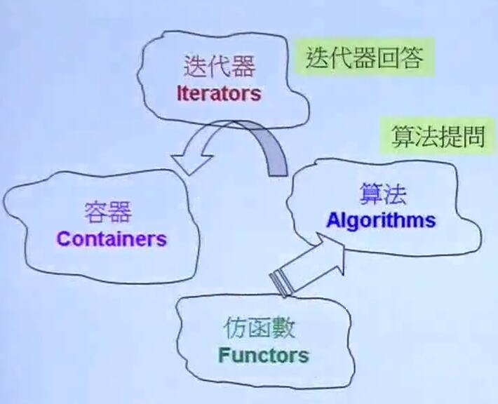
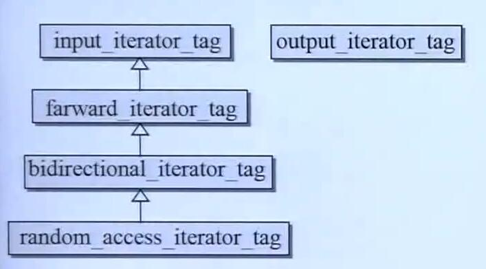
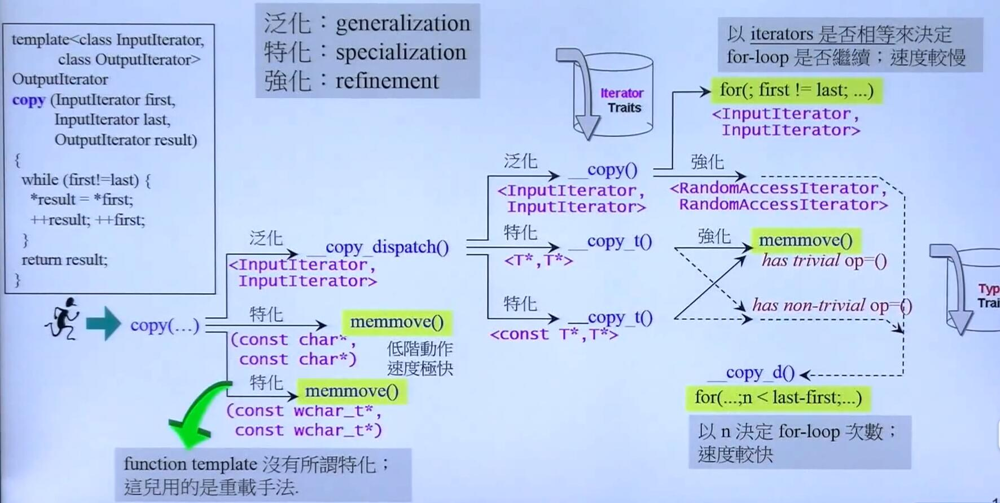
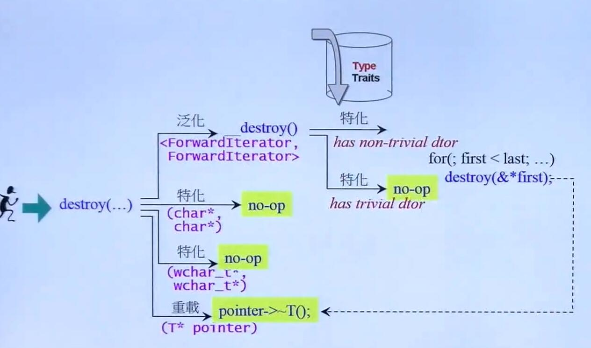
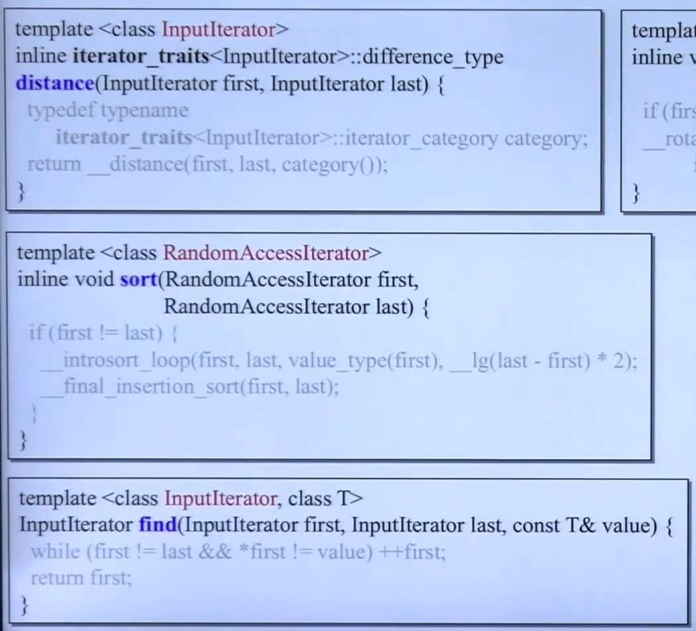

# STL算法

## STL算法简介



1. 算法是用来处理容器的
2. 算法看不见容器的内容，通过容器提供的迭代器 iterator 对容器的元素进行访问
3. iterator 必须回答算法回答的问题，否则编译就会报错.
4. 算法是函数模板

算法通常有以下的形式:

```c++
template<typename Iterator>
Algorithm(Iterator itr1, Iterator itr2){
    ....
}

// 算法可以指定准则(比如比较准则)
template<typename Iterator,typename Cmp>
Algorithm(Iterator itr1, Iterator itr2, Cmp comp)
{
    ....
}
```

## Iterator的分类

STL 的容器 Iterator 有 5 种迭代器种类。这5种种类不是通过整数变量实现的，而是通过类(空类)实现的

```c++
// 五种 iterator category
struct input_iterator_tag{};
struct output_iterator_tag{};
struct forward_iterator_tag:public input_iterator_tag{};
struct bidirectional_iterator_tag:public forward_iterator_tag{};
struct random_access_iterator_tag: public bidirectional_iterator_tag{};

```



ps : 可以用 typeid().name()来获取类型的名称(编译器类型名称)

eg:

```c++
#include<typeinfo>  
cout<<typeid(itr).name;  // iter是某一种迭代器
```

## iterator_category对算法的影响

### difference 函数

STL 中有一个算法是 distance,获取两个iterator之间的距离。不同的 迭代器(比如随机访问迭代器和双向迭代器的计算distance方式不同，算法的效率也不同)

difference

```c++

template<class InputIterator>
inline typename iterator_traits<InputIterator>::difference_type
__distance(InputIterator first, InputIterator last, input_iterator_tag) {
    typename iterator_traits<InputIterator>::difference_type n = 0;
    while (first != last) {
        ++first; ++n;
    }
    return n;
}
template<class InputIterator>
inline typename iterator_traits<InputIterator>::difference_type
    __distance(InputIterator first, InputIterator last, random_access_iterator_tag) {
    return last - first;
}
// ----------------
template<class InputIterator>
inline typename iterator_traits<InputIterator>::difference_type
    distance(InputIterator first, InputIterator last) {
    typedef typename
        iterator_traits<InputIterator>::iterator_category category;
    return __distance(first, last, category());
}

/*
这里就说明了
为什么 分类要用类来实现了，
可以用参数类型来识别应该调用哪一个函数，
而不必写一堆的 if 函数，可以让代码变得很漂亮。
并且由于类型之间还有继承关系，在本例中，
对于非random access iterator 只需要写一份代码即可。很巧妙
*/
```

ps:

1. 用类来定义类型，用函数模板来匹配类型，通过给类型来匹配特定的函数，从而省去写 if 的功夫(新技能 get ! )
2. 从本例我们可以看到 迭代器的分类很影响算法的效率。比如本例是 O(n) 和 O(1) 的区别

### copy and destory




上面那张图说明，对于底层的函数，由于算法需要大量调用底层函数，需要保证底层函数的效率。所以STL实现中，对不同种类的迭代器(比如 raw pointer, random access iterator, 普通的 input_iterator)执行最适合这种类型的操作来达到效率最大化。

### 算法对迭代器类型的暗示

* 算法没有强制要求输入的迭代器类型，但是在源码中，算法通过对模板参数的命名，**暗示**了使用者应该要使用某种类型的迭代器。
* 如果没有使用正确类型的迭代器，那么可能在编译的过程中会报错



## STL算法源码实例

1. ammunicate
2. count
3. count_if
4. find
5. find_if (顺序查找)
6. copy
7. copy_if
..

ps: STL 算法中有 heap 的算法


