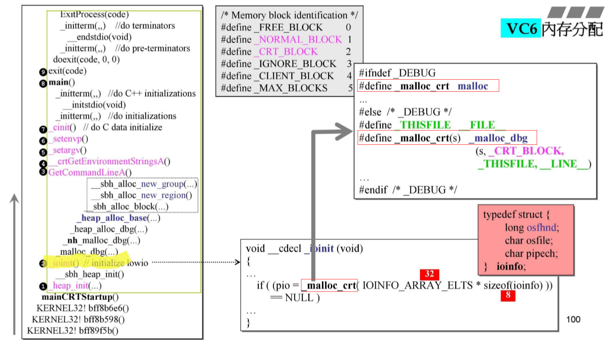
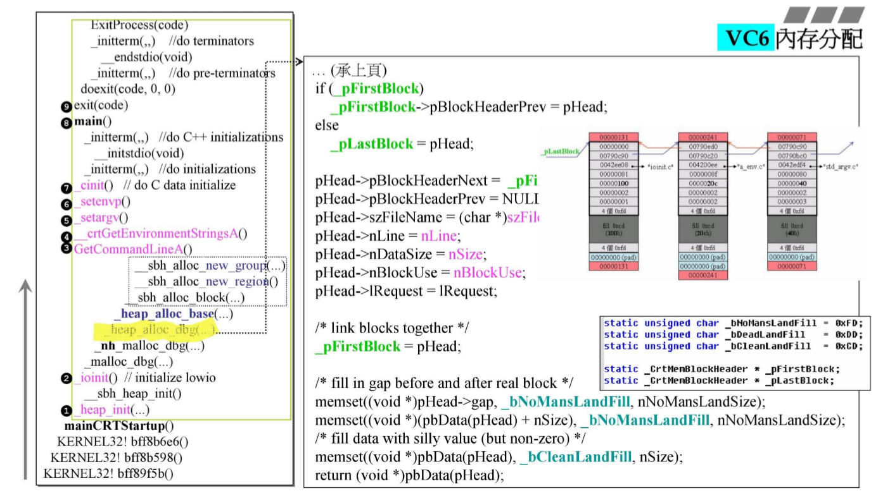

# C++内存管理(二) VC6 malloc

在不同的编译器，甚至是同一编译器的不同版本，malloc的实现方式可能都是不一样的，我们没有精力去研究每一种实现方式，而是希望集中精力学习VC6 malloc, 学习其设计思想，以期能够触类旁通、举一反三。

## 1. small block heap SBH

我们都知道，malloc 动态分配的内存是在 heap 上的，SBH 顾名思义，专门用来管理小区快内存的。对于大区块内存管理，VC6直接交给了操作系统。这种思路和之前的 std::alloc的内存管理思路类似。(std::alloc只负责 128k以下的内存块)(以上为个人的理解，不一定全部正确)

接下来将以 **VC6 debug**模式下，程序**第一次**的内存分配过程，来阐明 malloc 的运行机制。

调用堆栈图

在进入main之前，VC6中会先初始化 CRT (c run time ) memory。大致过程如下。

1. 在 `mainCRTStartup()`中调用了 `_heap_init(...)` (参数省略)
2. 在 `_heap_init(...)` 中初始化了 SBH进行内存管理所需要的数据结构，或者也可以称为SBH的控制中心
3. `heap_init`之后调用了 `_ioinit()`初始化 io, 在里面我们着重关注它是如何申请内存的。
4. 在`_ioinit()`中，调用了 `_malloc_dbg(...)`申请内存，`_malloc_dbg(...)` 事实上就是 malloc (后面会说)
5. 在 `_malloc_dbg(...)`中调用了 `_nh_malloc_dbg(..)` 然后在 `_nh_malloc_dbg(..)`中又调用了`_heap_alloc_base(...)`..... 开始进行内存管理
6. 上图右侧的 判断语句，说明了SBH是为小区块的内存管理服务的
7. 如上所述，理解 SBH 的 初始化操作 `__sbh_heap_init()` 和 第一次内存分配操作 `_malloc_dbg(...)` 中的原理对理解malloc十分重要

## 2. SBH初始化 —— _heap_init()和 __sbh_heap_init()

  
在进入 SBH的一开始需要初始化SBH的 headers(控制中心)。具体表现为:

1. 向操作系统内要一块内存 _crtheap
2. 在 `_crtheap`里，在 _crtheap 中配置 SBH所需要的 headers。一共有16个headers。
3. `__sbh_pHeaderScan` 表示 header数组的首地址
4. `__sbh_pHeaderDefer` 涉及到 Header的回收(还给操作系统)的“延迟机制" ，后面会谈到
5. `__sbh_cntHeaderList`是实际使用的 headers的计数
6. `__sbh_sizeHeaderList` 表示 header的个数，有16个 header
7. 每一个 header 负责管理 1M 的内存

### 2.1. header的数据结构

(ps: 待后面补充)

## 3. 在 _ioinit()中调用 malloc

这张图主要说明了在 _ioinit()中进行了**第一次**的内存分配(使用 malloc), 我们之后将以此着手分析 malloc 的行为

## 4. debug模式下malloc准备工作

### 4.1. debug 模式下的特殊区块

我之前所有涉及到内存管理的笔记和cookie有关的图，都有一张图表明在 debug 模式下多了很多"东西”，现在来看看这些多出来的"东西"

看一下 `_CrtMemBlockHeader` 结构体。该结构体就是 debug模式多出来的东西之一

1. `pBlockHeaderNext` 和 `pBlockHeaderPrev` 。分别指向 下一块debug模式下分配的内存 和 上一块 debug模式分配的内存。也就是说在 debug模式下所有分配出去的内存应该都被 "串起来了"(向链表一样)
2. `szFileName` - `IRequest` 表示申请的文件名，在第几行申请的等 debug所需要的额外信息
3. `gap[nNonMansLandSize]` 这里的 gap表示无人区，在VC中(包括VS2017),无人区由 0xfd 填充。在用户申请的内存(绿色的那块)的上下各有一块无人区(每个无人区 4 个字节)。有了无人区之后一旦用户使用的时候越过内存边界 debug 就能及时报告

### 4.2. 计算debug额外区块的大小

**除了** `_CrtMemBlockHeader`之外

1. 如前所述，在所申请的区块的下方也有一块无人区
2. 语句 `blockSize = sizeof(_CrtMemBlockHeader) + nSize + nNoMansLandSize` 表示计算目前所需要的内存块大小， nSize表示用户申请的字节数， nNoMansLandSize表示下方的那块无人区
3. `pHead = (_CrtMemBlockHeader*)_heap_alloc_base(blockSize)` 表示根据我们上一步计算出来的区块大小，通过这个函数要内存。

### 4.3. debug模式成功分配内存之后

`_heap_alloc_base` 通过调用这个函数成功分配内存之后。_heap_alloc_dbg()函数还需要..

这段代码做了

1. 这段代码中出现了两个指针 `_pFirstBlock` 和 `_pLastBlock`，分别指向debug已分配内存块链表的头和尾，在成功分配内存之后，首先把先分配的内存块链到链表上。
2. 对 `_CrtMemBlockHeader` 内的值进行赋值。
3. 填充 无人区 和 用户真正需要的内存块的值。在上图右下角声明了一些初值

    1. _bNoMansLandFill = 0xFD, 说明无人区用 0xFD 填充，也就是在debug模式下如果指针越界了，经常会出现的值
    2. _bDeadLandFill = 0xDD, deadland表示已回收的内存块(或者说未分配的内存块)的值都被重设为 0xDD。相对应的如果使用已经 delete的指针，或者使用**野指针**可能会出现 0xDD
    3. _bCleanLandFill= 0xCD, cleanland表示已分配但未被赋值(还没有调用构造函数)的区域.malloc只负责分配内存，因此用户所需的内存块的初值被设为 0xCD, 根据之前的叙述，new 表达式 在malloc还需要调用构造函数。

### 4.4. 再看 _heap_alloc_base(blockSize)

重新回到分配内存的 _heap_alloc_base(blockSize) 函数。有两个指的注意的地方

1. 在 `_heap_alloc_base`这个函数一开始
  
  

  如果要的区块太大了(>1016),那么交给操作系统。否则从 SBH中分配内存。这点在一开始的时候提到过。为什么大小是 1016？SBH负责的最大的内存块是 1024 SBH分配出去的每一个内存块都带有上下 cookie，一个cookie在VC6下是 4 个字节，所以 cookie一共 8个字节 **1016+8=1024**。
  
2. 如果通过 SBH 分配内存

  

* 需要在 上一步获得的 block (调试区块+用户所需内存+无人区)的首位加上两个 cookie (也就是代码中的 2* sizeof(int), 共 8 个字节)。同时将其调整到16的倍数。
* 看右图，cookie有 $2*4=8$ 个字节。 _CrtMemBlockHeader 有32 个字节 (包括上无人区，32=20h),下无人区有 4 个字节。用户需要 100h(256) 个字节。 所以总共需要  $ 100h + 20h + 4h + 2*4h = 12Ch$ 调整为 16 的边界之后变为 $130h$

130h 就是在本次分配中总共需要的所有内存呢。做完准备工作之后，我们现在可以深入到 __sbh_alloc_new_region() 中探索SBH的内存管理方式。

## 5. SBH中的内存管理模块

在进入 `_heap_alloc_base` 之后又顺序调用了 `__sbh_alloc_new_region()`和 `__sbh_alloc_new_group()` 。（由于是第一次分配内存，所以有初始化控制中心的动作) 表明其分配创建了 region 和 group。那么 region 和 group 是什么 ?

### 5.1. SBH header

回到之前提到的 sbh headers， 我们知道 headers 是 sbh的控制中心 

对于 header 事实上:

1. 一块 header 管理着 1M 的内存(虚地址空间)
2. 一个 header 有一个指针 pRegion指针指向一个 region ，region也是一个控制中心
3. 一个 header 有一个指针 pHeadData（1M）指向实际的内存

### 5.2. SHB region

(橙色部分)

#### 5.2.1. region 数据结构

对于一个 region 。region是一个控制中心，region使用了位图的概念

1. 一个 region下有32个 group,一个 region管理 1M内存
2. indGroupUse. int是32位,这个变量表示当前正在使用哪一个group
3. BITVEC 是 32位的 unsigned int, 变量 bitvGroupHi[32] 和 bitGroupLo[32] 所对应的内存一共有 32*64位。
  
    * 事实上一个 region 有 32个 group
    * 一个 group 有 64 条双向内存块链表(类似于 std::alloc)
    * 这里的 32\*64 的某一位就表示某一个group下的某一条链表是否挂着内存块

4. grpHeadList[32] 表示一个 region下有32个 group
5. 一个 region的大小大致为 16k
6. cntRegionSize 的含义我不是很清楚

### 5.3. SBH group

下图展示了group大致的形状

1. 一个 region 有 32 个 group,所以一个 group 掌管 32k 的内存
2. 一个 group 有 64 条链表
3. 64条链表 以16为倍数 分别负责 16,32.....1024 个字节的内存(共64条)。(这也解释了为什么内存分配实际分配的内存是16的倍数)
4. 一共有64条链表，一开始拿到 32k的 内存的时候，先把 32k 的内存切分为 8 个 page,一个page 4k,挂在最后一条链表上。
5. 每次分配内存，先沿着 freelist找，在所有的64 条链表中找到 比所需内存大链表中最小的分配内存。如果都没有最从最后一条链表(挂了8个page)上切分。
6. region 中的位图就是为了方便寻找链表而设置的

#### 5.3.1. group 数据结构

对于每一个 group

1. cntEntries 记录了分配出去的内存次数，每次 malloc 该变量+1, 每次 free 该变量 -1.
2. listHead[64] 有 64 调自由链表
3. tagListHead 和 tagEntry 在实现上使用了内嵌指针的思路。listHead 里有 2 个指针，分别指向前一个 tagEntry 和 后一个 tagEntry, 而一个 tagEntry 里却有3个变量，对于这64个tagEntry来说，每两个 tagEntry 的 sizeFront 和 pEntryPrev是互相重叠的，第一个 tagEntry的 sizeFront不受影响。这么做可能是为了省内存或者炫技。好好体会一下就好。

#### 5.3.2. group 的内存分布

1. 一个 group 有 64 条链表
2. 64条链表 以16为倍数 分别负责 16,32.....1024 个字节的内存(共64条)。(这也解释了为什么内存分配实际分配的内存是16的倍数)
3. 一共有64条链表，一开始拿到 32k的 内存的时候，先把 32k 的内存切分为 8 个 page,一个page 4k,挂在最后一条链表上。
4. 每次分配内存，先沿着 freelist找，在所有的64 条链表中找到 比所需内存大链表中最小的分配内存。如果都没有最从最后一条链表(挂了8个page)上切分。
5. 当内存分出去之后，回收的时候如果大小<1k,应该把它链到其余63条链表合适的某一条链表上。
6. region 中的位图就是为了方便寻找链表而设置的

对于最后一条链表,最后一条链表是 std::alloc和 malloc设计的不同之处之处。

1. 最后一条链表链着8个page，共32k
2. 最后一条链表可以看成一个池子，group所掌管的所有的内存都在这里，并且这8个page的内存都是连续的。换言之，虽然前面63条链表通过指针串在一起，是不连续的，但是串在一起只是通过设定指针的值为这8个page的地址空间的某个值，这些内存块实际上还在这8个page中
3. 最后一条链表的这种实现方式，可以实现当free的时候，能够很快地将小的内存块和比你高为大的内存块。并当所有内存都回收的时候将内存还给操作系统

对于一开始的一个page

1. 0xffffffff 表示 不同的page不能再合并了
2. 在page的上下两个 4080表示上下两个 cookie，最后一位为0就表示 有 4080 byte的内存没有被分配出去
3. 保留区域的大小是 8个字节，目的是为了时中间的可分配内存是 16 的倍数。

### 5.4. SBH 第一次——内存分配

1. 4080 = 0ff0h
2. 我们前面提到了第一次内存分配总大小为 130h
3. 因此如图所示，切割了 130h 出去。把相应的 cookie的最后一位设为1
4. 切割完之后，剩余的内存为 0ec0h (0ff0h- 130h = 0ec0h)
5. 在 group的内存分配中所述，如果 这块 130h的内存 free了，它将被挂到 #12号链表上 (130h / 16 -1 = 12)

至此我们对于 SBH的控制模块已经看完了，完事具备只欠东风，现在可以来看一下SBH的内存分配过程

## 6. SBH内存管理过程实例

### 6.1. VC6 内存管理首次分配

首次分配需要:

初始化: 

1. 初始化 headers。 headers 有 16个 header.(第一个 header 以 MEM_RESEVER模式要1M内存，先要但并没有实际分配)
2. 初始化 groups 控制器。 每个 header 有 32个group
3. 初始化 group list 下的控制模块

当需求端发出需求，需要 130h 的内存的时候。

1. 第一个 header的第一个 group, 向操作系统实际要32k的内存(真的要了)。将32k 内存分为 8 个 page 链在 list#63上。并将位图的相应位置为1
2. 开始分配内存由于第一个 header的第一个group只有 最后一条链表上有内存块，所以从最后一掉条链表的 page1 中切割 130h大小的内存给用户。page1剩余 ec0h 大小的内存块
3. 将 64条链表最开始的 cntEntries +1.(看下下前面的数据结构)

### 6.2. 第二次——分配

1. 需要 240h, 应该由 list#35提供，但上面没有挂内存，所以还是由最后一块内存提供。 切掉 240h 剩余 ec0h -240h = c80h
2. 将 64条链表最开始的 cntEntries +1.(看下下前面的数据结构)

### 6.3. 第三次——分配

类似 第二次分配

### 6.4. 第15次——归还(不合并)

1. 在经过数次内存分配之后，在第15次(以15为例),内存被回收了，回收的正式第三次分配中分出去的 240h
2. 将对应的 cookie最后一位设为0.
3. 但是此时不应该直接还到最后一条链表上，240h 对应着 24h-1 = 35， list#35号链表(此时无法进行内存块的合并，内存块合并之后会说)。因此将240h 挂到 35号链表上
4. 将 cntEntries -1

### 6.5. 第16次——分配(非最后一条链表分配)

1. 需要 b0h 的内存。 b0h 应该由 list#10 提供
2. 但是 10号链表上没有内存块，于是向后找找到 list#35 找到了 35号链表(上一步刚刚回收) 现在由 35号链表提供
3. 切掉对应的 b0h 大小的内存，并设置 cookie之后(如图)，剩下 240h - b0h = 190h.
4. 此时 190h 对应这 19h-1 = 24 对应 list#24 24号链表，于是将对应的内存块挂到24号链表上
5. 完成操作之后，设置位图，并将cntEntries +1 .

### 6.6. 第n次——分配(使用新的group)

1. 当进行到了若干次分配之后，group1的位图为 `02000014 00000000` (每一位都是16进制数)。有若干条链表上挂着内存块。
2. 但此时又申请了 230h 大小的内存，group1 已经没有链表(包括最后一条)能满足需求了，于时开始使用group2，重新申请了 32k的内存。由 group2满足需求

### 6.7. 回收(合并内存块)

1. 当回收一个内存块的时候，需要尝试能否合并内存块
2. 判断能不能合并需要判断上面的内存块能否合并 和 下面的内存块能否合并
3. 本内存块上cookie向上 4 个字节，读取上一个内存块的下cookie，可以获得上一个内存块的大小和是否被分配出去了(cookie的最后一位)
4. 本内存块下cookie向下看4个字节，读取下一个内存块的上cookie，可以获得下一个内存块的大小和是否被分配出去了(c
ookie的最后一位)
5. 通过上下 cookie 能够判断是否可以合并内存块以及合并之后的大小。内存块合并之后，计算合并之后的新的大小(链到合适的链表上)

## 7. SBH内存管理回收

### 7.1. 确定 header,group,list

回收的时候可能需要合并内存，也可能不合并内存，两种情况在上面的部分都有涉及。现在问题的关键在于，得到一根指针，如何确定该指针:

1. 落在哪一个Header内
2. 落在哪一个Group内
3. 落在哪一个free-list内(落在那一号链表)

对于 1 ， 由于一个 header的大小是固定的(1M),我们也有 header的首地址的指针，只要判断指针的范围就可以判断在哪一个header内
对于 2 ， 类似1，我们知道 group的首地址，也知道一个group对应内存的大小(32)自然也可以判断在哪一个group中
对于 3 ，可以根据cookie来判断落在哪一跟链表

### 7.2. 将内存还给操作系统

为什么 sbh, 要分 group 分 list？为了实现更加精细的内存管理。分得更细，那么这段内存被全部回收的可能性更大，更有利于 sbh将内存还给操作系统。(以一个group为单位进行回收)

如何将内存还给操作系统?

### 7.3. 判断全回收:

1. 需要判断全回收(也就是分配出去的内存),可以根据每个group 上的 cntEntries 的变量来判断是否全回收，每次分配 cntEntries++, 每次回收cntEntries--,当cntEntries==0的时候全回收
2. 当全回收的时候，由于每一次回收都会合并内存块，所以当全回收的时候，group将出于初始状态，也就是有 8 个 page(4k) 挂在最后一条链表上

#### 7.3.1. 延迟全回收:

1. 在一开始的 heap_init的时候，有一个变量 __sbh_pHeaderDefer 指针，指向某一个全回收的 group 所述的 header。
2. 这个 group指的是本应该被释放(上一个出现全回收的group)，但是被延迟回收了。
3. 当有下一个全回收的 group出现的时候，sbh释放这个 defer group, __sbh_pHeaderDefer的指针的值设为这个新的 group
4. 如果下一个全回收的 group还没有出现，这个defer group 又分配了内存，那么将 defer指针的值设为 NULL

## 8. malloc 总结

### 8.1. malloc 设计总结

vc6 malloc 的设计很值得我们借鉴，现在总结如下:

1. 采用两级分配器，如果 >1k就直接交给操作系统，否则使用第二级分配器
2. 第二级分配器采用了 16个header(1M)-32个group(32k)-64条list (16,32...1k) 三级内存管理。使得内存管理更加精细化，更有利于实现精准的内存分配和更方便的内存回收(还给操作系统)
3. 使用 64条内存块链表，分别对应 16,32,48.....1024的内存。使得当出现内存碎片的时候，内存碎片能被挂到链表上。最后一条链表挂着 8 个 page , 这 8 个 page 在内存上是连续的。方便将内存还给操作系统
4. 进行连续内存分配的时候，采用了最大最小分配方法。即选择比 所需内存块大的但是在所有满足的size中最小的size进行内存分配。并由 64条自由链表来管理内存碎片
5. 采用 bit map 的方式，来方便地判断那一条链表上挂着内存块
6. 使用 上下 cookie机制，实现在 free的时候进行内存块的合并，尝试将上下内存块都进行合并，将小的内存块合并为大的内存块，并将合并后的内存块挂到合适的链表上，从而减少了内存碎片
7. 使用 cntEntries 很方便地判断一个 group的内存是否全回收(被很多 allocater借鉴) 分配内存的时候 +1，回收内存的时候 -1。
8. 采用 延迟回收的方式将 某一个 header的某一个 全回收的 group还给操作系统
9. 综上，我认为内存管理有两个很值得学习的点 1 内存块链表 2 cookie 3 cntEntries

### 8.2. vc6malloc vs std::alloc

共同点；

1. 都采用了2级分配器
2. 都采用内存块链表进行更精细化的内存管理。不同 # 的链表，对应不同 size的内存块

不同点: 

1. malloc 有 cookie 而 alloc没有cookie，因此malloc 能够处理内存碎片合并内存块并返还操作系统，而 alloc就无法处理内存碎片，无法合并内存块，并且无法将内存还给操作系统十分霸道
2. malloc 有 上下 cookie，而 alloc 去除了 cookie 节省了空间

总结 : 

经过 malloc 的学习，我更加理解为什么有了 malloc之后，还要有 alloc，主要目的并不是为了提升内存分配的速度。因为 malloc已经很快了，而是为了去除cookie，节省空间。因为 std::alloc的主要服务对象是容器，容器管理着很多大小相同，数量较多的元素，在这种应用场景下，alloc去除cookie的特性能够节约内存。

### 8.3. 其它平台的内存管理

经过我自己的测试，gcc 7.50 只有上cookie，下cookie的值为0 (有下cookie，但我不能理解为什么值为0，或许等待日后有机会再去看一下源码吧)，而在 VS2017中 我死活都找不到 cookie(带式在调试模式下我找到了上下无人区)。可能的解释是，在VC6之后(比如VC10)的malloc，不再进行这么精细化的管理了，因为malloc做的事情事实上和操作系统做的事类似，而我们知道 VC6 是在 windows 平台上的，所以很有可能 VS2017直接将这部分工作交给了操作系统(毕竟都是一家的)防止出现重复性工作。